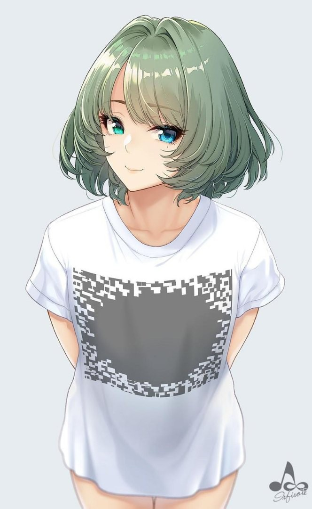

# Image resizing and cropping

Original image:

)

End file : 200x200

## Crop with .getSubimage()
It's work fine, because he is not lose quality. But you can get incorrect image

For, example:


Source code:
```java
    BufferedImage originalImage = ImageIO.read(new File("img/original.jpg"));
    BufferedImage subImage = originalImage.getSubimage(300, 150, 200, 200);
    File outputFile = new File("img/croppedImage.jpg");
    ImageIO.write(subImage, "jpg", outputFile);
```

So, we need image resizing

There is two ways to do it:
* Raw Java SE methods
* Use external libraries with Progressive Scaling

## Using Graphics 2D
```java
    public static void main(String[] args)  {
        try {
            BufferedImage originalImage = ImageIO.read(new File("img/original.jpg"));

            BufferedImage resizedImage = createResizedCopy(originalImage, 200, 200, true);

            File outputFile = new File("img/resizedImage.jpg");
            ImageIO.write(resizedImage, "jpg", outputFile);

        } catch (IOException e){
            e.printStackTrace();
        }
    }

    static BufferedImage createResizedCopy(Image originalImage, int scaledWidth, int scaledHeight, boolean preserveAlpha)
    {
        int imageType = preserveAlpha ? BufferedImage.TYPE_INT_RGB : BufferedImage.TYPE_INT_ARGB;
        BufferedImage scaledBI = new BufferedImage(scaledWidth, scaledHeight, imageType);
        Graphics2D g = scaledBI.createGraphics();
        if (preserveAlpha) {
            g.setComposite(AlphaComposite.Src);
        }
        g.drawImage(originalImage, 0, 0, scaledWidth, scaledHeight, null);
        g.dispose();
        return scaledBI;
    }
```

Result:


Yeah, we have the worst quality.

## Using libraries with Progressive Scaling

So, I used fastest library (in my opinion) for this task

### [Thumbnailator](https://github.com/coobird/thumbnailator)
Uses the progressive bilinear algorithm if the target is at least half of every dimension, 
otherwise it uses simple Graphics2d bilinear scaling and bicubic for upscaling.

Source code:
```java
    BufferedImage imageToScale = ImageIO.read(new File("img/original.jpg"));
    int dWidth = 200;
    int dHeight = 200;
    Resizer resizer = DefaultResizerFactory.getInstance().getResizer(
            new Dimension(imageToScale.getWidth(), imageToScale.getHeight()),
            new Dimension(dWidth, dHeight));

    BufferedImage scaledImage = new FixedSizeThumbnailMaker(
            dWidth, dHeight, false, true).imageType(BufferedImage.TYPE_INT_RGB).resizer(resizer).make(imageToScale);

    ImageIO.write(scaledImage, "jpg", new File("img/thumbnailatorImage.jpg"));
    System.out.println("Successful!");
```

Result:


### Resizing and cropping
Now, lets combine this methods to get really good scaled avatars for users:

```java
    // we use here all!

    final int WIDTH = 200;
    final int HEIGHT = 200;
    BufferedImage originalImage = ImageIO.read(new File("img/original.jpg"));

    // let's crop first, because we need to save image properties before scaling

    // So, we need to make x == y
    BufferedImage subImage;
    int delta = originalImage.getHeight() - originalImage.getWidth();

    if (delta > 0) {
        subImage = originalImage.getSubimage(0, delta/2 , originalImage.getWidth(), originalImage.getHeight() - delta);
    } else if (delta < 0){
        subImage = originalImage.getSubimage(-delta/2, 0 , originalImage.getWidth() + delta, originalImage.getHeight());
    } else {
        subImage = originalImage;
    }

    // Now we can resize our image to our dimensions

    Resizer resizer = DefaultResizerFactory.getInstance().getResizer(
            new Dimension(subImage.getWidth(), subImage.getHeight()),
            new Dimension(WIDTH, HEIGHT));

    BufferedImage scaledImage =
            new FixedSizeThumbnailMaker(WIDTH, HEIGHT, false, true)
                    .imageType(BufferedImage.TYPE_INT_RGB)
                    .resizer(resizer)
                    .make(subImage);

    ImageIO.write(scaledImage, "jpg", new File("img/resizedAndCropped.jpg"));
```

Result:

